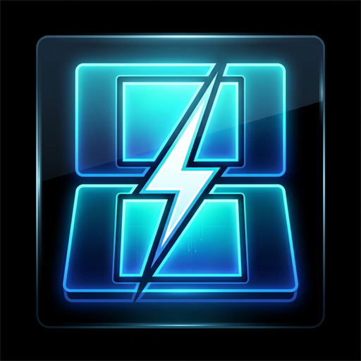

<p align="center">
  
</p>

<h1 align="center">STORM DS</h1>

<p align="center">
  <strong>Next-Generation High-Performance Nintendo DS & DSi Emulator for Android</strong>
</p>

<p align="center">
  <a href="https://github.com/ReiKatari/STORM_DS/releases"></a>
  <a href="#"></a>
  <a href="#"></a>
  <a href="#"></a>
</p>

---

## ⚡ О проекте / About

**STORM DS** — это мощный, ультрасовременный эмулятор Nintendo DS и DSi для Android, ориентированный на максимальную производительность, премиальный дизайн и бескомпромиссную стабильность.

Эмулятор оснащен высокоскоростным графическим конвейером Vulkan, продвинутой поддержкой шейдеров RetroArch, интеграцией с RetroAchievements (включая автономный оффлайн-режим) и полностью настраиваемым выводом на внешние мониторы и телевизоры.

---

## ✨ Ключевые возможности / Key Features

### 🚀 Высокая производительность и движки рендеринга
* **64-битный JIT-компилятор** ARM64 для максимального FPS и минимальной задержки ввода.
* **Vulkan 3D & Fastpath**: Аппаратный графический конвейер нового поколения с оптимизированной загрузкой текстур и динамическим отсечением.
* **Рендереры OpenGL, Compute и Software** с масштабированием внутреннего разрешения (до 4x+).
* **Шейдеры RetroArch (librashader)**: Поддержка популярных пресетов CRT, LCD, хэндхелд-сеток и сглаживания в реальном времени.
* **Поддержка кастомных драйверов Adrenotools** для устройств на процессорах Snapdragon.

### 🎨 Премиальный интерфейс и темы STORM
* **STORM NIGHT** (тема по умолчанию): Глубокий OLED Cyber Black (`#000000` / `#0D0D10` / `#16161C`) с неоновыми акцентами Electric Cyan (`#00E5FF`).
* **STORM DAY**: Стильная контрастная светлая тема (`#F3F4F8` / `#FFFFFF`) с глубокой типографикой.
* **Современные шрифты**: Space Grotesk & Manrope с идеальной читаемостью каждого меню и описания.
* **100% Полная русская локализация**: Каждая строчка, диалог, подсказка и экран настроек переведены на чистый русский язык.

### 🏆 RetroAchievements & Оффлайн-профиль
* Достижения, таблицы лидеров и режим **Hardcore**.
* **Автономная синхронизация (Offline Play)**: Достижения сохраняются локально при игре без интернета и автоматически отправляются на сервер при подключении сети.
* Отображение карточки профиля и очков прямо в библиотеке и на внешнем экране.

### 🎮 Сенсорное управление и геймпады
* Векторные элементы управления с тактильным откликом (Haptic Feedback) и физикой нажатий.
* Полная поддержка физических Bluetooth/USB геймпадов с гибким переназначением кнопок и комбо.
* Интуитивный редактор раскладки экранов с настройкой прозрачности, масштабирования и раздельного центрирования.

### 📺 Внешние дисплеи и второй экран
* Полноценная игра на телевизоре или внешнем мониторе через USB-C / HDMI док-станции (Odin 2, планшеты, смартфоны).
* Сенсорный экран остается активным на портативном устройстве, а верхний дисплей выводится на большой экран.
* Индивидуальные настройки внешнего экрана для каждого РОМа.

### 📁 Ультрабыстрый проводник и сканер РОМов
* Асинхронное фоновое индексирование каталогов через Android Storage Access Framework (SAF).
* Мгновенное кэширование иконок, баннеров и 3D-боксов.
* Поддержка прямых форматов `.nds`, `.dsi`, а также архивов `.zip` и `.7z`.
* Быстрый поиск, умная группировка по папкам и алфавитный указатель.

---

## 📲 Установка / Download

Релизные сборки APK доступны в разделе [Releases](https://github.com/ReiKatari/STORM_DS/releases):

* **`app-gitHub-prod-release.apk`** — Главная релизная версия с поддержкой Adrenotools и автоматическими обновлениями.
* **`app-playStore-prod-release.apk`** — Стандартная оптимизированная сборка.

---

## 🕹️ Интеграция с лаунчерами / Frontend Integration

STORM DS поддерживает запуск из популярных Android-оболочек (**Daijishō**, **Beacon Launcher**, **Pegasus**, **EmulationStation-DE**, **LaunchBox**):

* **Package Name**: `me.magnum.melondualds`
* **Activity Name**: `me.magnum.melonds.ui.emulator.EmulatorActivity`
* **Параметры запуска (Intent)**:
  * `Intent data`: URI NDS-файла (`content://...` или `file://...`) с флагом `FLAG_GRANT_READ_URI_PERMISSION`.

---

## 🛠️ Сборка из исходного кода / Building

### Требования
1. **JDK 21**
2. **Android SDK & NDK** (`28.0.13004108`+)
3. **CMake** (3.22.1+)
4. **Rust Toolchain** (`rustup` / `cargo`) для сборки `librashader` под архитектуры Android ABI (`arm64-v8a`, `armeabi-v7a`, `x86_64`).

### Команды сборки
```bash
# Клонирование репозитория вместе с субмодулями
git clone --recurse-submodules https://github.com/ReiKatari/STORM_DS.git
cd STORM_DS

# Сборка релизного APK для GitHub
./gradlew assembleGitHubProdRelease

# Готовый APK будет расположен по пути:
# app/build/outputs/apk/gitHubProd/release/app-gitHub-prod-release.apk
```

---

## 📜 Лицензия / License

Проект распространяется под лицензией **GPL-3.0 License**.

Основан на разработках [melonDS](https://melonds.kuribo64.net/) и [melonDS Android port](https://github.com/rafaelvcaetano/melonDS-android) с глубокими модификациями, оптимизациями интерфейса, ядра и графического конвейера STORM DS.
